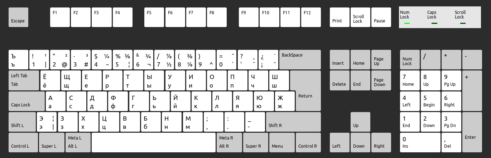

# English - Russian keyboard mapping

This is my custom mapping for russian alphabet in my english keyboard in Ubuntu.
I did this to avoid buying keyboard stickers for the usual Russian keyboard layout while I was learning Russian language.


## How to install

_Ubuntu 20.04.4 LTS_

1) Copy the file `rc` to the directory `/usr/share/X11/xkb/symbols`
2) Edit the file `/usr/share/X11/xkb/rules/evdev.xml:
   1) Find the section layoutlist.
   2) Add the following:
    ```xml
    <layout>
      <configItem>
        <name>rc</name>
        <shortDescription>rc</shortDescription>
        <description>RussianCustom</description>
        <languageList>
          <iso639Id>cod</iso639Id>
        </languageList>
      </configItem>
      <variantList>
      </variantList>
    </layout>
   ```
   
## Mapping


